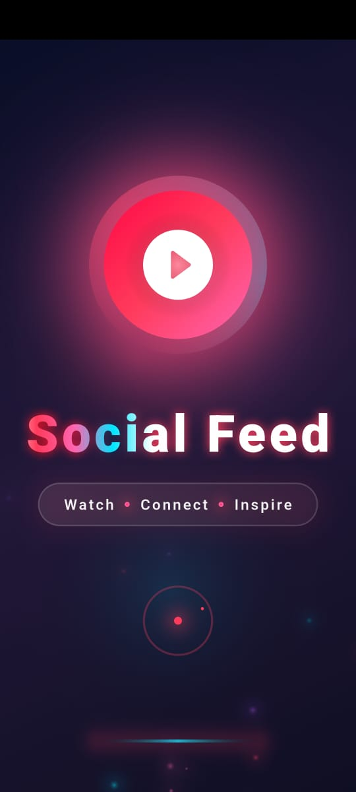
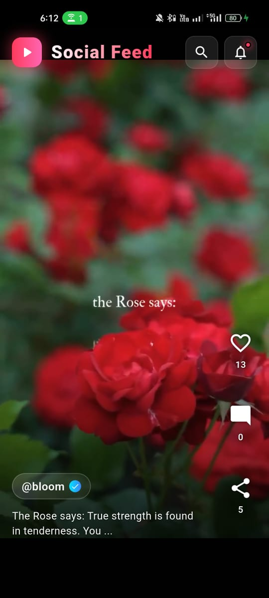
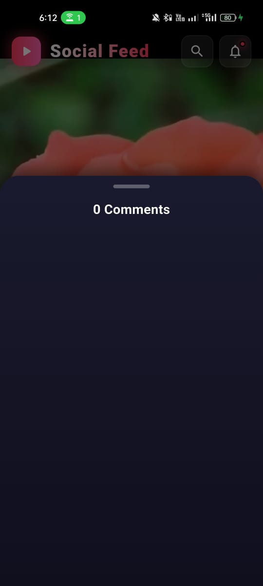

# 🖤 Social Feed App  

<p align="center">
  
</p>

<p align="center">
  
  
  
</p>

---

## ⚡ Overview  

**Social Feed App** is a modern, scalable mobile application built using **Flutter**, designed to deliver a seamless social experience.  

Built with a focus on **performance, clean architecture, and intuitive UI/UX**.  

---

## 🚀 Core Features  

- 📝 Create & share posts  
- ❤️ Like & interact  
- 💬 Comment system  
- 📰 Dynamic feed  
- 👤 User profiles  
- 🔔 Notifications  

---
## 📱 App Preview  

<p align="center">
  
  
  
</p>

## 🧠 Architecture  

```text
Presentation Layer (UI)
        ↓
State Management
        ↓
Business Logic
        ↓
Data Layer (API / DB)
